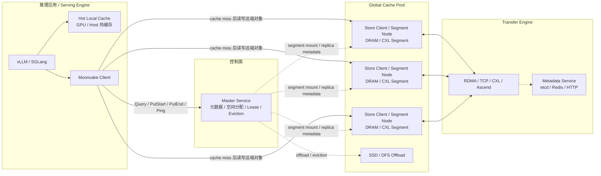
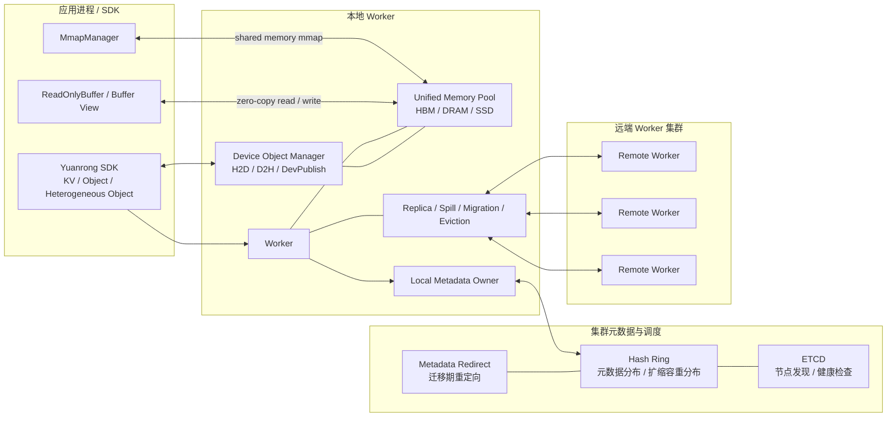

# Mooncake Store 与 Yuanrong Datasystem 架构图

## 1. Mooncake Store 架构图

要点：

- `Mooncake Store` 是 `Hot Local Cache + Global Cache Pool` 的分层设计。
- 控制面由 `Master Service` 集中负责。
- 数据面通过 `Transfer Engine` 在各 `Store Client / Segment Node` 之间传输。
- `master` 不直接搬数据，但所有对象元数据、空间分配、lease、eviction 都先经过它。

## 2. Yuanrong Datasystem 架构图

要点：

- `Yuanrong` 是统一内存池设计，`HBM / DRAM / SSD` 统一纳入 worker 管理。
- SDK 和同节点 worker 之间直接通过共享内存 `mmap` 做本地零拷贝读写。
- 元数据支持按 `Hash Ring` 分布式化，没有固定中心 `master` 成为热点读写瓶颈。
- 元数据迁移期通过 `Metadata Redirect` 把请求导向新的 owner。
