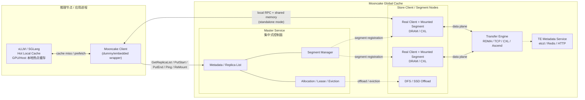
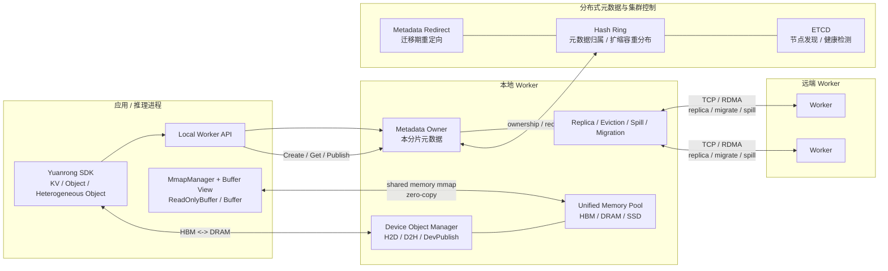
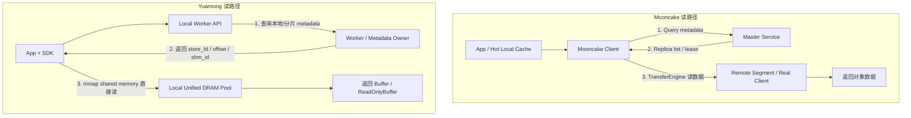

# Mooncake Store 与 Yuanrong Datasystem 架构对比图

> 说明
>
> - Mooncake 图基于当前仓库 `Mooncake` 的 `mooncake-store` 实现。
> - Yuanrong 图基于 `C:\Code\yuanrong-datasystem` 当前实现。
> - 为了突出差异，Yuanrong 这张图以“分布式元数据模式”来画；代码里仍保留 centralized master compatibility。

## 1. Mooncake Store：Hot Local Cache + Global Cache 分层

关键点：

- 本地热点缓存和全局 cache 池是分层/分离的。
- 读写热路径里，客户端先向 `master` 查元数据/申请空间，再走数据传输。
- `master` 不搬运数据，但负责对象元数据、segment 编排、lease/eviction。
- standalone mode 下，应用进程里的 dummy client 还会通过本地 RPC + shared memory 转给 real client。

## 2. Yuanrong Datasystem：统一内存池 + 分布式元数据 + 本地共享内存直读写

关键点：

- SDK 与同节点 worker 之间直接走共享内存，local read/write 可以直接 `mmap` 到 worker 返回的共享内存区域。
- worker 同时管理 DRAM/SSD 资源和元数据，可按 hash ring 做元数据分布式化。
- 元数据迁移时通过 redirect 机制把请求导向新的 metadata owner，而不是固定卡在单一中心节点。
- 从建模上更接近“统一内存池 + 分布式元数据 + 本地零拷贝”。

## 3. 你要强调的核心差异

一句话总结：

- **Mooncake** 更像 `Hot Local Cache + Global Cache Pool + Central Master Control Plane`。
- **Yuanrong** 更像 `Unified Memory Pool + Distributed Metadata Ownership + Local Shared-Memory Zero-Copy Access`。

## 4. 画图依据

### Mooncake

- `docs/source/design/mooncake-store.md`
  - `25-45`：Master Service / Client / dummy-real client / 单 master 与 HA 模式
  - `152-156`：master 负责元数据，不直接走数据流
  - `320-336`：`PutStart` / `PutEnd` 先后由 master 编排
- `mooncake-store/src/client_service.cpp`
  - `576-587`：`Query -> master_client_.GetReplicaList`
  - `879-944`：`PutStart -> TransferWrite -> PutEnd`
  - `1880-1889`：持续 `Ping` master，必要时 `ReMountSegment`
- `mooncake-store/src/master_service.cpp`
  - `554-589`：master 返回 replica list 并授予 lease
  - `591-699`：master 分配 replicas / handles
- `mooncake-store/src/real_client.cpp`
  - `163-230`：创建 client 并连接 master
  - `1063-1110`：先 `Query` 再 `Get`

### Yuanrong

- `README.md`
  - `27-38`：HBM/DRAM/SSD 多级缓存、共享内存免拷贝、分布式元数据
  - `52-75`：SDK / worker / ETCD 架构与通信路径
- `src/datasystem/client/object_cache/object_client_impl.cpp`
  - `445-475`：SDK 连接 local/remote worker，初始化 `MmapManager`
  - `1381-1410`：Create 时 worker 分配共享内存，客户端直接 `mmap`
  - `1824-1852`：Get 直接调用 worker API
  - `1885-1918`：根据 `store_fd / mmap_size / offset` 直接 `mmap` 共享内存
  - `1981-1989`：`workerApi->Get(...)`
- `src/datasystem/worker/object_cache/worker_request_manager.cpp`
  - `476-509`：worker 在响应里直接返回 `store_fd / offset / mmap_size / shm_id`
- `src/datasystem/client/mmap/embedded_mmap_table.cpp`
  - `32-49`：客户端收到 worker fd 后直接 mmap 并缓存
- `src/datasystem/worker/hash_ring/hash_ring.h`
  - `199`：`NeedRedirect`
  - `223-229`：hash ring worker 数
  - `283-288`：支持 distributed master / centralized master 两种模式
- `src/datasystem/worker/hash_ring/hash_ring.cpp`
  - `1250-1292`：扩缩容/迁移时按 hash ring 判断是否重定向
- `src/datasystem/master/metadata_redirect_helper.cpp`
  - `34-56`：metadata redirect 到新的 owner

> 备注
>
> - 为了突出 Yuanrong 的优势，上图默认画的是 **distributed metadata mode**。
> - 代码里也保留了 centralized master compatibility，所以如果后面要拿去做严格竞品材料，建议把“无中心瓶颈”表述成“**支持元数据分布式化，热点路径不依赖固定中心 master**”，会更严谨。
