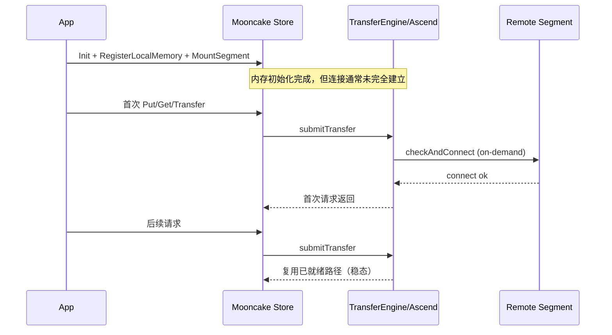

# Mooncake Store Ascend 模式：内存初始化与预热说明

> 说明：你提到的 `ascned` 这里按 `ascend` 处理。

## 1. 范围与结论

本文聚焦 `mooncake-store` 在 Ascend 模式下的两件事：

1. 内存初始化（分配、注册、挂载）。
2. 预热（warmup/preheat）在当前实现中的真实含义。

核心结论：

1. Mooncake Store 有明确的“内存初始化链路”。
2. Mooncake Store 没有单独的“预热 API”；预热主要表现为“首个传输请求触发建链与路径就绪”的隐式过程。

## 2. 依据（文档与代码）

### 2.1 设计文档

1. `docs/source/design/transfer-engine/ascend_transport.md`
2. `docs/source/design/transfer-engine/ascend_direct_transport.md`
3. `docs/source/design/transfer-engine/index.md`
4. `docs/source/design/mooncake-store.md`

### 2.2 关键代码路径

1. `mooncake-store/src/client_service.cpp`
2. `mooncake-store/src/real_client.cpp`
3. `mooncake-store/src/utils.cpp`
4. `mooncake-transfer-engine/src/transport/ascend_transport/ascend_direct_transport/ascend_direct_transport.cpp`

## 3. Ascend 模式内存初始化：分阶段说明

## 阶段 A：Transfer Engine 初始化与 Ascend 传输安装

在 `Client` 初始化时，`mooncake-store` 会做下面几件事：

1. 读取协议参数，如果协议是 `ascend`，会检查环境变量 `ASCEND_ENABLE_USE_FABRIC_MEM`。
2. 调用 `TransferEngine::init(...)` 完成引擎初始化。
3. 调用 `installTransport("ascend", ...)` 安装 Ascend 传输层。

对应代码：

1. `mooncake-store/src/client_service.cpp:277`
2. `mooncake-store/src/client_service.cpp:285`
3. `mooncake-store/src/client_service.cpp:365`

---

## 阶段 B：本地 buffer（local_buffer）初始化与注册

`RealClient::setup_internal(...)` 中会创建本地 buffer allocator：

1. `local_buffer_size > 0` 时分配本地内存。
2. 立即调用 `RegisterLocalMemory(...)` 注册给 Transfer Engine。
3. 这块内存主要用于客户端读写请求相关缓冲，不等同于对外贡献的全局存储段。

对应代码：

1. `mooncake-store/src/real_client.cpp:250`
2. `mooncake-store/src/real_client.cpp:255`

分配细节（Ascend）：

1. 默认走 `aclrtMallocHost(...)`。
2. 如果开启 Fabric Mem，则走 `aclrtMallocPhysical + aclrtMapMem`。

对应代码：

1. `mooncake-store/src/utils.cpp:129`
2. `mooncake-store/src/utils.cpp:131`
3. `mooncake-store/src/utils.cpp:151`

---

## 阶段 C：全局 segment（global_segment）初始化、注册与挂载

如果 `global_segment_size > 0`，`RealClient` 会循环分段挂载：

1. 按 `max_mr_size` 拆分 segment。
2. 分配每个 segment 的内存。
3. `MountSegment(...)` 时先 `registerLocalMemory`，再向 Master 注册可分配的 segment 元数据。

对应代码：

1. `mooncake-store/src/real_client.cpp:297`
2. `mooncake-store/src/real_client.cpp:312`
3. `mooncake-store/src/real_client.cpp:328`
4. `mooncake-store/src/client_service.cpp:1518`
5. `mooncake-store/src/client_service.cpp:1542`

与设计文档一致：

1. `docs/source/design/mooncake-store.md:385`

---

## aclrtMallocHost 调用时机（总结）

`aclrtMallocHost` 不是在 `init` 时无条件调用，而是在 Ascend 协议下“真正分配内存”时触发。当前实现里主要有两类触发点：

1. `local_buffer` 分配时触发  
   调用链：  
   `RealClient::setup_internal(...)`  
   -> `ClientBufferAllocator::create(local_buffer_size, protocol, ...)`  
   -> `allocate_buffer_allocator_memory(...)`  
   -> `aclrtMallocHost(...)`（默认路径）。

2. `global segment` 分配时触发  
   调用链：  
   `RealClient::setup_internal(...)`（循环挂载 segment）  
   -> `allocate_buffer_allocator_memory(segment_size, protocol)`  
   -> `aclrtMallocHost(...)`（默认路径）。

统一分支条件（在 `allocate_buffer_allocator_memory` 内）：

1. 仅当 `protocol == "ascend"` 且 `total_size > 0` 时进入 Ascend 分配分支。
2. 若开启 `ASCEND_ENABLE_USE_FABRIC_MEM` 且编译支持 Fabric Mem，则走  
   `aclrtMallocPhysical + aclrtMapMem`，不会调用 `aclrtMallocHost`。
3. 未开启 Fabric Mem 时，走 `aclrtMallocHost`。

对应代码：

1. `mooncake-store/src/real_client.cpp:250`
2. `mooncake-store/src/real_client.cpp:312`
3. `mooncake-store/src/client_buffer.cpp:41`
4. `mooncake-store/src/utils.cpp:129`
5. `mooncake-store/src/utils.cpp:131`
6. `mooncake-store/src/utils.cpp:151`

---

## 阶段 D：Ascend Direct 传输层侧的内存注册

在 Ascend Direct Transport 中，`registerLocalMemory(...)` 会：

1. 推断内存类型（HOST/DEVICE）。
2. 更新 metadata 的本地内存描述。
3. 调用 ADXL `RegisterMem(...)` 完成本地可传输内存注册（某些 buffer-pool 场景会跳过 ADXL 注册）。

对应代码：

1. `.../ascend_direct_transport.cpp:433`
2. `.../ascend_direct_transport.cpp:474`
3. `.../ascend_direct_transport.cpp:485`

## 4. “预热”在当前实现里的真实语义

## 4.1 没有独立 warmup API

在 `mooncake-store` 与 Ascend transport 文档里，没有一个单独命名为 warmup 的生产接口。

## 4.2 预热 = 首次请求触发的按需建链与路径就绪

Transfer Engine 设计文档明确了连接是按需建立：

1. 端点连接不会在启动时全部配对。
2. 通常在“第一个请求”到来时建立连接。

参考：

1. `docs/source/design/transfer-engine/index.md:69`

Ascend Direct 代码对应行为：

1. 首次传输时进入 `checkAndConnect(...)`。
2. 连接成功后进入稳定传输。

对应代码：

1. `.../ascend_direct_transport.cpp:819`
2. `.../ascend_direct_transport.cpp:1123`

因此，“预热成本”通常体现在首个 Put/Get 或首批 transfer 请求上，而不是 init 完就全部摊平。

## 5. 流程图

## 5.1 初始化总流程（内存视角）

```mermaid
flowchart TD
    A[RealClient setup_internal] --> B[Client::Create]
    B --> C[TransferEngine::init]
    C --> D[installTransport('ascend')]
    D --> E{local_buffer_size > 0?}
    E -->|Yes| F[分配 local buffer]
    F --> G[RegisterLocalMemory(local buffer)]
    E -->|No| H[跳过 local buffer 注册]

    G --> I{global_segment_size > 0?}
    H --> I

    I -->|Yes| J[按 max_mr_size 切分 segment]
    J --> K[分配 segment 内存]
    K --> L[MountSegment]
    L --> M[registerLocalMemory(segment)]
    M --> N[向 Master 挂载 segment 元数据]

    I -->|No| O[仅做客户端角色，不贡献 segment]
```

## 5.2 预热与稳态流程（请求视角）



## 6. Ascend 相关配置项（与初始化/预热关系最强）

1. `ASCEND_ENABLE_USE_FABRIC_MEM`
   作用：启用 Fabric Mem 分配路径。

2. `ASCEND_AUTO_CONNECT`
   作用：控制 ADXL 自动连接行为；关闭时更明显体现“首传建链”成本。

3. `ASCEND_CONNECT_TIMEOUT`
   作用：连接超时；首传建链失败优先看这个参数。

4. `ASCEND_TRANSFER_TIMEOUT`
   作用：传输超时；首批请求失败时重点排查。

5. `ASCEND_USE_SHORT_CONNECTION`
   作用：短连接模式；会增加重复建链概率，不利于“预热后稳态复用”。

## 7. 实操建议（面向上线）

1. 启动后先做一轮小流量试传输（例如小对象 Put/Get）作为预热。
2. 观测首传时延与后续时延差值，确认预热收益。
3. 若首传失败，优先排查连接超时、设备设置、`/etc/hccn.conf`、以及内存注册是否成功。

## 8. 备注：对齐要求

Ascend 文档中明确提到：

1. 在 HCCS/相关场景下，注册内存存在 2MB 对齐要求（尤其是设备内存）。
2. 使用 Ascend Direct 前需要先正确设置 device（例如 `torch.npu.set_device(...)`）。

请以当前部署的 transport 类型（Ascend Transport / Ascend Direct Transport）和 CANN 版本为准做最终校验。
